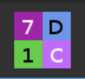

# Background

This is not offical MTRN4230 advice I was just frustrated with the UTM VM being slow to start and unreliable. This solves that problem.
While the VM method creates a VM instead I will be using Docker which allows us to create and manage little containers. So we will run our sim in a container and as you will see later we can easily view the simulator in the browser

# Setting up

## Prerequisites

-   docker
-   docker-compose

You need to have installed Docker and docker compose installed. Instructions for doing this depend on your operating system and Docker has already provided guides for doing this [here](https://docs.docker.com/compose/install/).

### Mac + Homebrew

If you are on Mac its even easier to do it with homebrew. If you don't know what homebrew is then just ignore this section and follow the guide on [the Docker website](https://docs.docker.com/compose/install/). If you have homebrew then run

```
brew install docker docker-compose
```

and then

```
brew install --cask docker
```

## Clone this repository

You will need the files in this repo so clone this repository either with git if you have it or download the zip. These options are available in the code dropdown on this page.

## Run the container

`cd` into the directory where you cloned or download this repository. Then run

```
docker compose up
```

You may see this error

```
$ ursim-mtrn4230 git:(main) ✗ docker compose up
Cannot connect to the Docker daemon at unix:///Users/user/.docker/run/docker.sock. Is the docker daemon running?
```

If you do, just find the Docker desktop app you downloaded previously and open that and try again.
If you don't see an error then you should see things start happening.
You will know it has worked if you see something like this

```
[+] Running 11/11
 ✔ ursim Pulled                                                                                                                                                113.6s
   ✔ 7b8b6bf0f55c Pull complete                                                                                                                                 59.5s
   ✔ 8b1b242883e7 Pull complete                                                                                                                                106.2s
   ✔ 71c4f3d2b85d Pull complete                                                                                                                                  1.2s
   ✔ dd01ba54b422 Pull complete                                                                                                                                105.6s
   ✔ 026db64beb54 Pull complete                                                                                                                                107.2s
   ✔ a37f29517be6 Pull complete                                                                                                                                  1.5s
   ✔ 5c9256e0f3ca Pull complete                                                                                                                                 30.7s
   ✔ e4d0a9160bf8 Pull complete                                                                                                                                107.9s
   ✔ 019e6da0a5b6 Pull complete                                                                                                                                 30.8s
   ✔ e123a7a81471 Pull complete                                                                                                                                  1.3s
[+] Running 2/2
 ✔ Network ursim-mtrn4230_default    Created                                                                                                                     0.0s
 ✔ Container ursim-mtrn4230-ursim-1  Created                                                                                                                     0.5s
Attaching to ursim-1
ursim-1  | Universal Robots simulator for e-Series:5.9.4
ursim-1  |
ursim-1  |
ursim-1  | IP address of the simulator
ursim-1  |
ursim-1  |      172.18.0.2
ursim-1  |
ursim-1  |
ursim-1  | Access the robots user interface through this URL:
ursim-1  |
ursim-1  |      http://172.18.0.2:6080/vnc.html?host=172.18.0.2&port=6080
ursim-1  |
ursim-1  |
ursim-1  | Access the robots user interface with a VNC application on this address:
ursim-1  |
ursim-1  |      172.18.0.2:5900
ursim-1  |
ursim-1  |
ursim-1  | You can find documentation on how to use this container on dockerhub:
ursim-1  |
ursim-1  |      https://hub.docker.com/r/universalrobots/ursim_e-series
ursim-1  |
ursim-1  |
ursim-1  | Press Crtl-C to exit
ursim-1  |
ursim-1  |
```

Despite what it says you wont be able to access it from the ip address mentioned in the output can instead access the simulator now from the URL.
<http://localhost:6080/vnc.html?host=localhost&port=6080>.

Its not required but if you instead would like to use the ip mentioned follow the guide under Network Setup [here](https://docs.universal-robots.com/Universal_Robots_ROS2_Documentation/doc/ur_client_library/doc/setup/ursim_docker.html)

## Quitting the Simulator

As the output suggests you can hit `Ctrl + c` to quit the sim. But if you loose this terminal you wont be able to do this. Instead you can `cd` back into the folder and run

```
docker compose down
```

## Configurations

1. First thing to do in the sim is to go the the `hamburger icon in the top right -> settings -> Password` and set a password this enables automatic and manual mode.
2. Then go to `System -> Remote Control` and enable remote control mode.
3. Check in the top you see this icon

    

## Connecting from MATLAB

Make sure the robot is powered on in the sim. You can use any of the files from the provided course repo to test

<https://github.com/rag-h/MATLAB_UR5e_RTDE/tree/main/examples>

but make sure you set the ip address to be

```
host = '127.0.0.1';
```

## References

-   <https://hub.docker.com/r/universalrobots/ursim_e-series>
-   <https://docs.universal-robots.com/Universal_Robots_ROS2_Documentation/doc/ur_client_library/doc/setup/ursim_docker.html>

## Trouble Shooting

Sim works but shows no controller? -> update your docker see here <https://forum.universal-robots.com/t/container-for-ursims-polyscope-reports-no-controller/26510>
